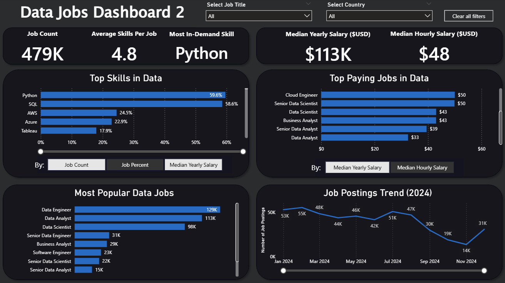

# Power BI Data Jobs Dashboard Portfolio

This repository contains a collection of dashboards that I created to assist **job seekers** in providing accurate, detailed information about the current data job market. These dashboards utilize a *real-world* dataset of data science job postings in 2024 (including titles, salaries, locations, and more) to provide an easy-to-use tool to explore market trends and compensation in the world of data jobs.

# Featured Dashboards
The dashboards below explore different aspects of the data job market using different visualizations. Each has its own README with details about the build process and included features.

## Data Jobs Dashboard V1 (Comprehensive/Exploratory)

### Skills Utilized
- Dashboard Layout/Design
- Power Query (ETL/Data Cleanup)
- Data Modeling (Tables/Relationships)
- Implicit Measures and Aggregations
- Charts
    - Core Charts (Bar, Line, Area, Column)
    - Other Charts (Map, KPI Cards, Tables)
- Interactivity (Slicers, Buttons, Bookmarks)
- Drill-Through Function

[**View Full Project Details (README).**](Data_Jobs_V1/README.md)

## Data Jobs Dashboard V2 (Single Page/Focused)

### Skills Utilized
- Advanced Dashboard Layout/Design
- Data Shaping/ETL (Power Query)
- Data Modeling (Star Schema)
- DAX Measures
- Implicit Measures and Aggregations
- Advanced Use of Charts (Bar, Line, KPI Cards)
    - Chart Parameters
- Slicer Interactivity

[**View Full Project Details (README).**](Data_Jobs_V2/README.md)

## About This Portfolio
The dashboards included within this portfolio have their own `README.md` file (located in their respective folders) to offer deeper insights into the project's objectives and skills used. 

Both dashboards included were completed in conjuction with [Luke Barousse's Power BI for Data Analytics](https://www.lukebarousse.com/powerbi) course. I highly recommend checking out his courses!